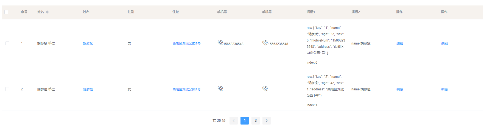

## 使用说明
>建议根据项目需求修改table的二次封装和样式
### 目录说明
* style    样式
* component 组件
   * table.vue  表格封装
   * search.vue 搜索封装
   * demo.vue      集合展示页面
   * utils.js      需要的工具类封装



``` js
// 数据
const dataSource = [{
  key: '1',
  name: '胡彦斌',
  age: 32,
  sex: 0,
  mobileNum: '15663236548',
  address: '西湖区湖底公园1号'
},
{
  key: '2',
  name: '胡彦祖',
  age: 42,
  sex: 1,
  address: '西湖区湖底公园1号'
}
]
// 表格头设置
const columns = (that) => [{
  type: 'selection'
},
{
  label: '序号',
  type: 'index'
},
{
  label: '姓名',
  prop: 'name',
  unit: '单位',
  props: {
    sortable: 'sortable'
  }
},
{
  label: '姓名',
  prop: 'name',
  click: (row, column, index) => {
    alert(row.name)
  }
},
{
  label: '性别',
  prop: 'sex',
  formatter: (row, column, index) => {
    return row.sex === 0 ? '男' : '女'
  }
},
{
  label: '住址',
  prop: 'address',
  newjump: (row, columns, index) => {
    return `/studentInfo/index/${row.accountId}`
  }
},
{
  label: '手机号',
  render: (h, parmas) => {
    return [h('i', {
      class: 'el-icon-phone-outline',
      style: 'fontSize: 22px'
    }), h('span', parmas.row.mobileNum)]
  }
},
{
  label: '手机号',
  render: (h, parmas) => {
    //   JSX
    return [
      <i class='el-icon-phone-outline' style='fontSize: 22px'></i>
      <span>{parmas.row.mobileNum}</span>
    ]
  }
},
{
  label: '插槽1',
  slotName: 'slot1'
},
{
  label: '插槽2',
  slotName: 'slot2'
},
{
  operates: true,
  label: '操作',
  btn: [{
    label: '编辑',
    isShow: row => {
      return row.status !== 2
    },
    disabled: row => {
      return row.status === 2
    },
    method: row => {
      that.handleNewJump(row)
    }
  }]
}
]
// 表格操作按钮
const operates = (that) => [{
  label: '编辑',
  isShow: row => {
    return row.status !== 2
  },
  disabled: row => {
    return row.status === 2
  },
  method: row => {
    that.handleNewJump(row)
  }
}]

const pagination = {
  currentPage: 1,
  pageSize: 10
}

```

```vue
<template>
    <ElementTablePack
        :dataSource='dataSource'
        :columns='columns'
        :pagination='pagination'
        :dataTotal='20'
        :operates='operates'
        :tableEvents='{select:select}'
        @handleSelectionChange='handleSelectionChange'
        @handleChangePage='handleChangePage'
        >
        <template slot-scope="scope" slot="slot1">
        <p> row:{{scope.data.row}}</p>
        index:{{scope.data.$index}}
        </template>
        <template slot-scope="scope" slot="slot2">
            name:{{scope.data.row.name}}
        </template>
    </ElementTablePack>
</template>
<script>
import { ElementTablePack } from './components'
import { dataSource, columns, pagination, operates } from './tableProp'
export default {
  components: { ElementTablePack },
  data () {
    return {
      dataSource: dataSource,
      pagination: pagination,
      columns: columns(this),
      operates: operates(this),
      tableEvents: {
        select: (selection, row) => this.select()
      }
    }
  },
  methods: {
    handleNewJump (row) {
      console.log(row)
    },
    handleSelectionChange (selection) {
      console.log(selection)
    },
    handleChangePage (currentPage) {
      console.log(currentPage)
    },
    toggleRowSelection (dom) {
      console.log(dom)
    },
    select (selection, row) {
      console.log(selection, row)
    }
  }
}
</script>
```

API
***
### ElementTablePack Attributes
| 参数 | 说明 | 类型 | 可选值 | 默认值 |
|  ----  | ----  | ----  | ----  | ----  |
| dataSource | 表格数据 | Array | — | — |
| columns    | 表格列的配置描述 表头部分 | Array | — | — |
| operates   | 表格操作按钮 | Array | — | — |
| dataTotal  | 分页数据总数	| Number | — | — |
| pagination | 分页的配置项	| Object | — | — |
| border     | 是否展示外边框和列边框 | Boolean | — | false |
| loading    | 是否显示loading | Boolean | — | false |
| options | table参数扩展属性（复选框等）[Table Attributes](https://element.eleme.cn/2.8/#/zh-CN/component/table) | Object | — | — |
| tableEvents | table绑定事件 [Table Events](https://element.eleme.cn/2.8/#/zh-CN/component/table) | Object | — | — |
***
### ElementTablePack Methods
>根据项目需求在源代码添加方法或通过tableEvents添加

| 事件名 | 说明 | 参数 |
|  ----  | ----  | ----  |
| handleSelectionChange | 当选择项发生变化时会触发该事件 | selection |
| handleChangePage      | 页码改变的回调，参数是改变后的页码及每页条数 | currentPage |

***
### ElementTablePack Slot
| name | 说明 | 
|  ----  | ----  | 
|  beforeColum  | 插入至columns定义列前  | 
|  afterColum  | 插入至columns定义列后，operates操作列前  | 

***
### columns Attributes
| 参数 | 说明 | 类型 | 可选值 | 默认值 |
|  ----  | ----  | ----  | ----  | ----  |
| label     | 列头显示文字 | String | — | — |
| prop      | 列数据在数据项中对应的 key | String | — | — |
| type      | 表格column的type  | String | selection/index/expand | — |
| align     | 设置列的对齐方式 |left/center/right| — | left |
| width     | 列宽度 | string/number | — | — |
| operates | 是否为操作列(也可使用ElementTablePack 的 operates属性添加操作列)  | Boolean | — | false |
| btn | operates为true时 操作按钮（配置同operates）  | Array | — | — |
| slotName | 该列使用插槽的name 参数为 { row, column, $index } | String | — | — |
| unit      | 单位  | String | — | — |
| content   | 默认值 | String | — | — |
| props     | 列表参数扩展属性Table-column Attributes  | Object | — | — |
| render    | 生成复杂数据的渲染函数，参数分别为createElement，当前行数据  | Function(h, record) {} | — | - |
| formatter | 数据格式化 | Function(row, columns, index) {} | — | — |
| newjump   | url页面跳转 | Function(row, columns, index) {}	 | — | — |
| click   | 单元格点击回调方法 | Function(row, index) {}	 | — | — |

***
### operates Attributes
>若项目操作列样式固定，建议使用该属性，可根据项目修改操作列代码
参考element-ui [button](https://element.eleme.cn/2.8/#/zh-CN/component/button)

| 参数 | 说明 | 类型 | 可选值 | 默认值 |
|  ----  | ----  | ----  | ----  | ----  |
|  label  | 按钮名称 | String  | — | 操作  |
|  type  | 按钮类型 | String  | —  | text  |
|  plain  | 是否朴素按钮 | Boolean  | —  | false  |
|  icon  | [按钮icon图标](https://element.eleme.cn/2.8/#/zh-CN/component/icon)  | String  | —  | —  |
|  size  | 按钮大小 | String  | —  | small  |
|  isShow | 是否展示  | Function(row, index) {}  | — | —  |
|  disabled | 是否禁用  | Function(row, index) {} | —  | false |
|  method  | event 事件  | Function(row, index) {}  | —  | —  |